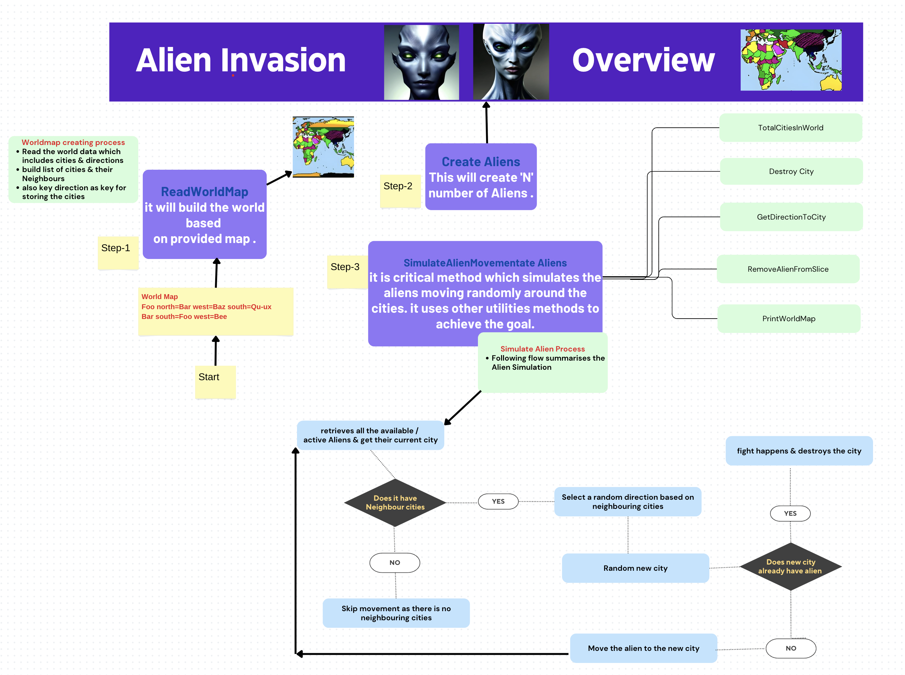
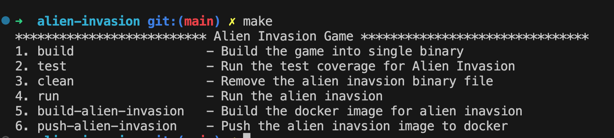

# Alien Invasion
* [Overview](#overview)
* [Design Summary](#design-summary)
* [Implementation Approach](#implementation-approach)
* [Data Structures](#data-structures)
* [Build & Run](#build-run)
* [Assumptions](#assumptions)
* [Sample Run](#sample-run)

### Overview: 
 To design & implement Mad aliens invastion to the imaginary world.

### Design & Assumptions Summary
1. Create a world map using the provided file.
2. Create `N` number of aliens based on the input.
3. Assumption: The number of aliens cannot exceed twice the number of cities in the world.
4. Simulate the movement of aliens by 
    - having them randomly choose a neighboring city to move to. 
    - If an alien encounters another alien in the new city, they engage in a fight that results in the destruction of the city.
    - When a city is destroyed, it is removed from the map, along with any roads leading to or from it.
6. The program prints the movement of each alien and any encounters or city destructions that occur.
7. After a certain number of iterations, the program stops, and the final state of the map is printed.

In summary, the design of the program involves creating a world map, generating aliens, and simulating their movement. The program handles alien encounters and city destructions, maintaining the state of the map throughout the simulation. The final result is displayed after a specified number of iterations.




### Implementation Approach 
I have started by splitting the requirements into smaller possible tasks, and my starting point was to think about the "Data Structure." We can summarize the approach as follows:

1. Defining Data Structure: This involves creating data structures such as cities, aliens, and other necessary entities. These structures will be used to represent the world map and the entities within it.

2. Methods to Operate on Data Structure: I have implemented methods to perform operations on the data structure. For example, I have created a method to read the world map and use it to create an imaginary world as a list of `City` type. Other methods include creating aliens and any other functionality required for the application.

3. Simulating Alien Movement: I am now working on implementing the logic for simulating alien movement. This step involves defining how the aliens will move within the world map and updating their positions accordingly. Additionally, I am developing utility methods to support the simulation process on need bases.

These steps will help us build the foundation of the application and make progress towards achieving the desired functionality.


### Data Structures
Now, let's go through an overview of the "Data Structure" as understanding them is important since the entire logic revolves around them. The main data structures used in the application are:

1. City Type: This data structure represents a city and contains the following information:
   - City Name: The name of the city.
   - Neighboring Cities and Directions: A map that stores the neighboring cities and their corresponding directions.
   - List of Aliens Assigned to the City: This is a list that keeps track of the aliens assigned to the city.

2. Alien Type: This data structure represents an alien and includes the following information:
   - Alien ID: A unique identifier for the alien.
   - Alien State: The current state of the alien (e.g., alive, destroyed, etc.).
   - Current City: The city in which the alien is currently located.

3. WorldMap: This is a map that represents the entire world and contains instances of the City Type. It provides a structured representation of the cities and their relationships.

Understanding these data structures is crucial as they form the foundation for the application's logic.

### Build & Run
```bash
    make build
    make run worldmap=map.txt n=5
```
 Makefile, also comes with additional option, like cleanup, running the Tests, docker image etc, as show in the image below



### Assumptions 
1. Map is provided in the following format
```
    Foo north=Bar west=Baz south=Qu-ux
    Bar south=Foo west=Bee
```
2. The number of aliens should not greater then number of cities.
3. No more than two aliens can occupy a city
4. When all aliens died, it will print the remaining city map

### Sample Run
```
   make run
```
```
World Map before Alien Invasion: 5
Baz east
Qu-ux north
Foo south north west
Bee east
Bar south west

Hang on Alien Inavsion about to start:

Initial Alien Mapping:
Alien 1: City Qu-ux
Alien 2: City Foo
Alien 3: City Bee
Alien 4: City Bee
Alien 5: City Qu-ux
Alien 1 moved from Qu-ux to Foo
Alien 2 moved from Foo to Bar
Alien 3 encountered Alien 2 in Bar! They fought and destroyed the city.
Alien 5 encountered Alien 1 in Foo! They fought and destroyed the city.

Remaining World Map:
Baz 
Qu-ux 
Bee 
```